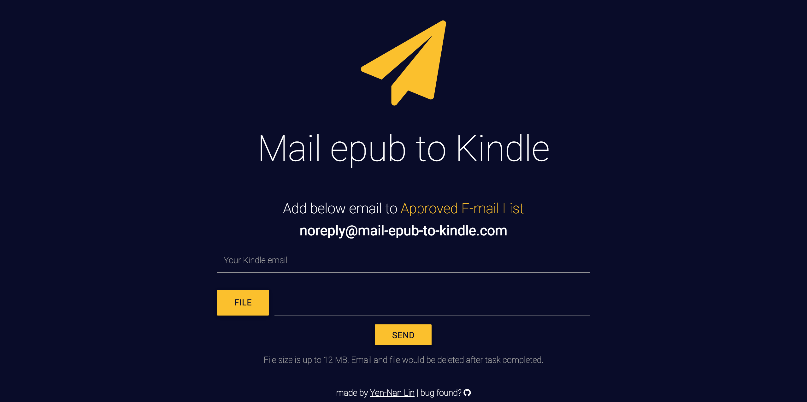

# Mail Epub to Kindle

A Rails app convert epub to mobi format and send the file to kindle by email.

Hosted on heroku https://mail-epub-to-kindle.herokuapp.com

## Getting start

Epub is one of popular ebook formats. Unfortunately, kindle does not support epub format. Here, I combine file conversion and mailing to kindle into single step.

All you need to do is add the mail `noreply@mail-epub-to-kindle.com` to [approved email list](https://www.amazon.com/manageyourkindle).

Then you can use this app all the time. Record of kindle address and file would be destroyed after 5 minutes when the mail sent.

## Technique Keywords

* CSS: materialize-sass, font-awesome
* Upload file: carrierwave
* epub to mobi converter: kindlegen
* Background job: sidekiq, redis-to-go
* Mail: sendgrid
* Copy by click: zeroclipboard-rails
* State machine: enum, ajax

## Contributing

1. [Fork it](https://github.com/masolin/mail_epub_to_kindle/fork)
2. Create your feature branch (`git checkout -b my-new-feature`)
3. Commit your changes (`git commit -am 'Add some feature'`)
4. Push to the branch (`git push origin my-new-feature`)
5. Create new Pull Request
